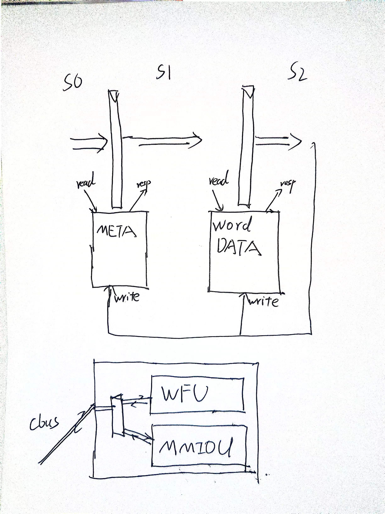

### NonBlockingDcache
非阻塞cache在这里负责处理lsu的请求，以及一些对于cache，总线资源的维护。

#### 1. 内部模块组件
- meta : 用于存储cache的meta信息，包括valid，tag，dirty等信息

- data : 用于存储cache的数据信息，一维展平,可以优化时序

- mshr :用于存储cache指令的miss信息，包括miss的地址，miss的状态等信息

- wfu : Write&Fetch Unit，连接着总线，用于处理对脏cache行写回内存，以及从内存中取新的行到cache中

- mmiou : 同样连接着总线，用于处理lsu发进来的mmio请求，包括读写

以及几个辅助模块
- wordWrite:用于处理粒度写
- MissArbiter:两个流水线发生了miss请求，仲裁谁放进mshr

#### 2. 内部流水线
流水线有状态对应的任务是
- lsu ：普通的lsu访存请求(无mmio)，包括读写。
s0:接到请求，将idx送入meta进行命中的判断
s1:接到hit与否，如果hit，就将命中后的pos送入data
s2:
    若命中，此时data会返回那个字，进行处理
        如果是ld指令，就将数据resp回lsu
        如果是st指令
            如果mshr没有正在等待的st指令，就正常做，将数据按粒度处理之后写回data，然后将那一行meta的dirty标记为true
            如果mshr有st指令，那就说明前面的st指令还在等待自己完成，后面的不要去做，按照storefailed的方式返回
    若miss经过missAribiter的处理，将miss的请求存入mshr中，等待有机会发出replay

- replayfind : 处理mshr指令的第一步，向wfu发请求
s0:按miss的地址去meta里面寻一个可替换的行
s1:meta将这个寻得的pos以及其他有关信息(要去fetch的自己的地址，以及可能写回内存的脏行的地址)送入wfu
    hai
    （此时metalogic会保留一个周期这个只读行信息，用于快速维持只读行的状态）
s2:这个时候将那个行设置成readOnly

- wb : wfu不存一整条cache行，而是"现用现取",wb代表wfu要从向内存写回的行那里拿一个字——因此一次对cache行的写回是需要16，32等周期数的
s0:由于wfu里面已经得知了要写回内存的行以及具体想要的哪一个字，s0不需要进meta再寻地址，不做任何操作
s1:将位置信息送入data
s2：data读取到这个字，送给wfu
    一个小机制：
    如果这个字的偏移是那一行的第一个字，说明这个时候要正式开始写回了，将这个行对应meta的readOnly标记为true，此时可以服务ld，但是不可以服务st（标志是st指令即使命中也返回miss）。

- refill: wfu执行fetch状态从内存中拿出的新行的某个字，写入cache
s0:由于wfu已经得知了要写入的行的位置，s0不需要进meta再寻地址，但是这个时候如果fetchReady,就要先通告mshr取好的地址以及pos信息,使其可以激活对应的可能等待的请求

s1:只需要按照指定的位置写回就好，因此也不需要读取data

s2:将那个字写入data
    一个特殊情况
    如果是fetchReady的时候,也就是写好了最后一个字,这个时候将新的meta行写回meta,同时

- replay: mshr中的miss请求被激活,重新发出来执行
s0:由于已经知道对应的全部位置信息,因此不需要meta参与
s1:将位置信息送入data
s2:读或写操作,将返回的resp通过0号返回lsu即可.

- mmioreq:mmio请求,lsu发送mmio的时候,保证两条流水线里面只有一条在处理mmio,另一条什么都不做
s0:无
s1:无
s2:将mmio请求送入mmiou,mmiou开始处理

- mmioresp:mmio回复,mmiou处理完毕,回复lsu
s0:会从mmiou发出一条req,这条req里面的data和uop就是最后要送给resp的,这里以"req"的形式出现只是载体
s1:无
s2:将resp通过0号流水线送回给lsu

#### 3. 一些细节
- 和lsu的ready交流
3.1 io.lsu.req.ready的意思lsu一定会认为发送进来了,因此当一些情况不想让lsu发送进来的时候,要将ready置为false,这些主要包括一些内部事务,以及不满足条件的情况:1.lsu想发st指令,但刚刚发生了storeFailed,需要lsu的st队列调整之后重发.2.lsu想发送mmio.但是当前的axi总线繁忙.

- 状态优先级
    wb和refill最高,因为wb一旦开始,必须保证从cache行读字的速度,比axi总线向内存写回要快,否则会出现数据混乱的情况.
    然后是mmio的req和resp
    再之后是replay,因为replay信号等了很久了,优先处理
    再之后是replayfind,因为replayfind是为了给replay提供激活wfu功能的
    再之后,在所有总线相关和处理miss指令之后,是普通的lsu请求

- axi线的互斥
由于只有一条axi线,而可能用到axi的有wfu和mmiou,因此要记录axi的状态,如果其中一个单元在忙,或者流水线中s1s2有即将动用两个单元的请求,那么就标记为忙,不允许其他axi请求来.

- kill机制
iskilledbyBranch,会在s0,s1,s2来检查
storeFailed,会在s0,s1检查
lsu的s1_kill,会kill掉当前s1的请求

- 分支预测处理
在每级流水线处理分支预测错误,随时准备判断kill的信号.
在每级流水线及时更新,GetNewBrMask

---
接下来是meta和data相关内容
### MetaLogic
处理meta逻辑,首先约定所有状态,都需要在s0发起读,s2和data一起发起写,否则会有复杂的冲突
读的case
- lsu_R: lsu普通的读指令,拿着s1返回的metaSet来对tag比较,判断命中与否,特别地对于readOnly的行,如果是st指令,也会返回miss
- replay_R:无具体工作
- mshr_R: 替换算法找到路号,已经对应的被换掉的行,送给wfu自行判断需不需要藏位写回

写的case
全部都是将写的请求传递给meta数据即可

### Meta
meta的数据,以Set存储,接收读写,实现了内部转发
存在一个写的机制:每一个字段(valid,dirty,tag等)都有valid和bits,只有对应位的valid为高,才能将bits的数值写进去.

### DataLogic
逻辑比较简单,无论读写都是直接将请求传递给data数据即可

### WordData
这里的data是一维的,会将idx,pos,和字偏移算出一个一维的idx,进行读或者写,单次读或写都是一个字
同样地也实现了内部转发.

### MSHR
mshr，也就是Miss Status Handling Register，用于存储cache指令的miss信息，包括miss的地址，miss的状态等信息

组织形式是包括一表和二表的

里面最基本的成分是表项MSHREntry
其内部记录了：
1. 数据部分MSHRdata：
根据一表二表，同一个字段可能有不同的含义
- valid:是否有效
- id：如果是一表项，这是一表项的id，如果是二表项，这是它被唤醒所依赖的一表项的id
- req DCacheReq，请求的内容
- pos 该请求再次发出去会是replay，这个时候要读哪一行的位置信息已经确定了，注意的是，这个pos不是一上来就随着请求存完的，而是对应的那一行彻底取好之后，随着fetchReady信号一起送进来的信息。
- waiting 该项是否在等待fetch
- ready 该项是否已经fetch完毕，所有都准备好，随时可以发出去repaly

2. 逻辑部分：
主要包括
- 一些判断的logic信号生成
- 如果是一表项，会进行块地址和传入的新的miss请求的块地址作比较，将结果传出去做首次还是二次miss的判断，也会进行和取好的块地址作比较，将匹配结果传出去看是否满足唤醒逻辑
- fire的时候写入的逻辑，在一表项，就更新完brmask之后正常写入，waiting为真，ready为假，二表项的时候，存在一种快速唤醒，写入的同一个周期标记该项被快速唤醒，然后下个周期直接变成ready状态
- 一个小的状态机
对于二表项：可以接到外部的wakeUp信号，直接到达激活状态，同时这个时候一定是有什么东西取好了，这个时候接收fetchedpos信号，将这个pos信息存入数据部分
对于一表项：如果在等待状态，看外部fetched取好的那个周期，一旦判断出是自己代表的块地址取好了，转ready激活状态；

对于二表项：如果在激活状态，外面做一个fire也就是"接收"，说明replay的东西被发出去了，自己就可以被清空了，等待下一次使用

对于一表项,清空则是通过reset信号实现的

整体架构在MSHRFile里面实现
MSHRFile包括四个一表项和八个二表项
主要的操作逻辑是
1. 当一个miss请求能够fire进入的时候，流程是
- 去所有一表项中先匹配valid的一表项里面存的块地址，看自己是不是FirstMiss
- 如果是，就既写入一表项，也写入二表项
- 如果不是，就直接找一个空的二表项，写入即可

这里涉及到一个机制，只有一表项发现自己被取好的那个周期，才会激活已经存入的二表项，
如果此时来了一个正要存入的请求并且是secondmiss,并且正好依赖的是这个下个周期就会被刷掉的一表项,显然会导致它再也不能被唤醒,那么最好的方法是判断出来这个情况,加入一个快速唤醒机制,在这个特殊的周期,二表项存入即激活,即可解决这个问题

（5.20快速唤醒除了进去就激活之外，也要立即存储fetchedpos）

2. 自己内部有正在等待的一表项
- 选出一个这样的表项，向外界留fetchable信号，让外界去取这个块地址（此时将引起Dcache的"取行"的流程）

3. 外面有某一行被取好的时候
MSHR会收到io.fetchReady，与之一并进来的，是该行的pos信息，将pos信息给二表项，计算出这个被取好的是一表项的第几个，也就是firstFetchMatchway，将所有期待这个表项id的二表项都激活，ready，等待repaly出去

与此同时一表项这个周期就会被清除掉，等待下一次使用
(因此也可见,一表项其实没有状态机的ready状态,在waiting被match到fetchReady的时候,下周期就直接被清除了)

4. 内部有被激活的二表项
向外面持续发出replay的valid信号,io.replay是个DecoupledIO,一旦外面接收到,就会将这个表项清除掉,等待下一次使用

接下来是wfu和mmiou相关内容
### WFU
分为ready :: fetch :: wb 三个状态
- ready:等待状态,等待新的请求
- fetch:正在从内存中取新的行到cache中,对外体现为refill
- wb:正在向内存写回数据,对外体现为wb

使用一个buffer,有execute_head和receive_head
向内存写,要求必须收到字比写回的速度快,因此从cache读占据了优先级,决定了wb一定是最高优先级的
从内存读向cache写,wfu占主动权,什么时候总线得到一个字,什么时候发出一个refill请求

### MMIOU
和wfu差不多三个状态ready :: fetch :: wb
mmio单元,用于处理lsu发进来的mmio请求,包括读写
发进来之后执行相应的axi读写
这里需要注意的是,实际上叫MMIOU不太好,所有uncachable的请求(不仅仅是mmio)都会被这个单元处理,mmio一定是一个字的粒度,但是一些uncachable的访存模式下面,st.b,st.h这种带着粒度的访存,也会被这个单元处理,因此这里要做axi线mask的粒度处理

在接下来是两个辅助小模块
### WordWrite
用于处理粒度写,传入那个字,然后按照粒度返回粒度写处理后的字

### MissArbiter
因为mshr一次最多存一个miss请求,因此对于两条流水线,需要做仲裁
这里模块化一下会比较清晰,简化了NonBlockingDcache那边的主逻辑

这里综合两条流水线的信息
- 选择一个请求存入mshr
- 根据两条流水线的情况决定最后的resp和nack信号
- 如果st指令存不进去,返回对应的storeFailed信号

### 全局的机制
#### 分支预测信息处理
被不停更新并检查是不是被kill了brmask的包括主阶段的s0,s1,s2,以及mshr的每个表项,如果有分支预测错误,会被kill掉,在主流水线体现为那个阶段对应valid信号为false,在mshr里面体现为那个表项被清除掉